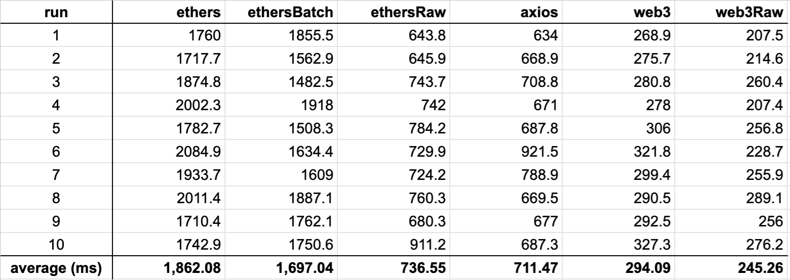

# Tx Receipt Benchmarking

Quick and dirty benchmark comparing fetching of Ethereum transaction receipts using [ethers.js](https://github.com/ethers-io/ethers.js/), [web3.js](https://github.com/ChainSafe/web3.js) and [axios](https://github.com/axios/axios). Shoutout [@emnul](https://github.com/emnul) for helping write this

## Results

## To run tests

1. replace the `jsonRpcUrl` variable in `index.js` with your own
2. `npm install`
3. `npm start`
